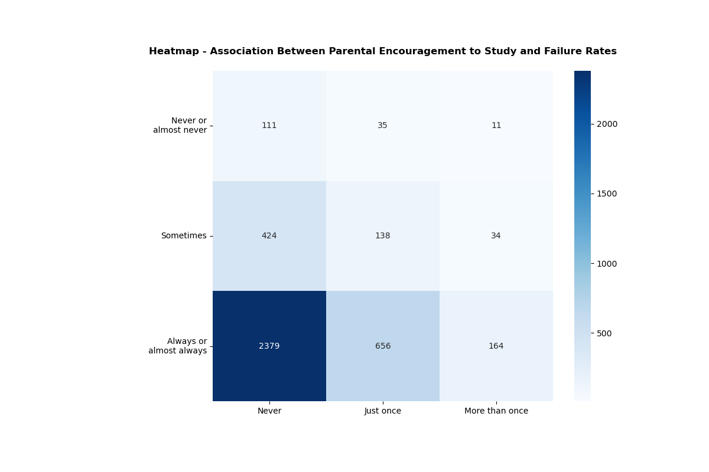
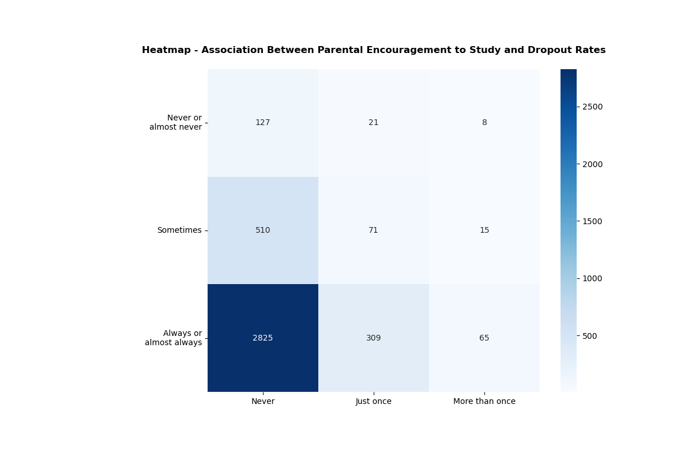
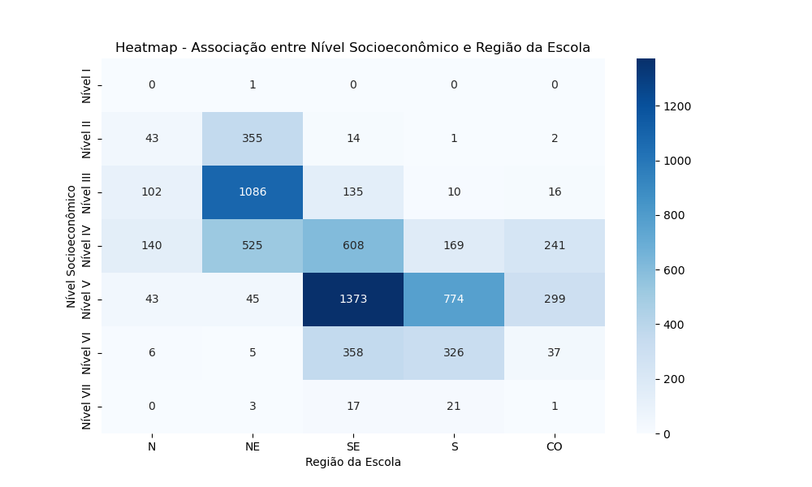

# Trabalho - A1 Linguagens de Programação
Bruno Cavalli, Erik Rolin, Nicholas Farrel

## About the project and the data

In this project, we perform data analysis and visualization using the Seaborn and Pandas libraries. The data used comes from the SAEB (Basic Education Assessment System), which offers a wide variety of data on students and their schools.

Since the original dataset was quite large, we have already performed data cleaning and removed the raw file from this repository. However, you can access the original dataset through the [open data portal](https://www.gov.br/inep/pt-br/acesso-a-informacao/dados-abertos/microdados/saeb) provided by the Brazilian government.

## Project structure

The project is organized in the following modules:

- `Python_scripts`: Contains the Python scripts used to clean the dataset and create the analyses.
- `Tests`: Contains all the python scripts used to test the modules
- `Data`: Contains the dataset `.csv` file.

## Getting started

### Prerequisites

To install the required packages, run the following command:

```bash
pip install -r requirements.txt 
````

## Generating Visualizations

To create the generations, you have to run the `main.py` file

````bash
python main.py
````

This will generate the following visualizations:

1. Heatmap - Association between Parents' Responses and Reproval Rate:

   


2. Heatmap - Association between Parents' Responses and Abandonment Rate:
   
   


3. Boxplot - Association between number of matriculated students and avarege score:

   

4. Boxplot - Association between students participation and the avarege score:

   

5. Boxplot - Association between region of the school and the avarege score:

   1.0 = Sudeste ; 2.0 =; 3.0=; 4.0=; 5.0=

   

6. Boxplot - Association between the state location of the scool and the avarege score:

   

7. Heatmap - Association between the region and the socioeconomical level of the school:

   

8. Boxplot - Association between school localization(Interior or Capital) and avarege score:

   

9. Boxplot - Association between the type of school (public or private) and the avarege score:

   


## Testing the modules

To test the modules, run:
````bash
pytest
````

If you want to run the test of an individual module, run:
````bash
pytest <file-name.py>
````